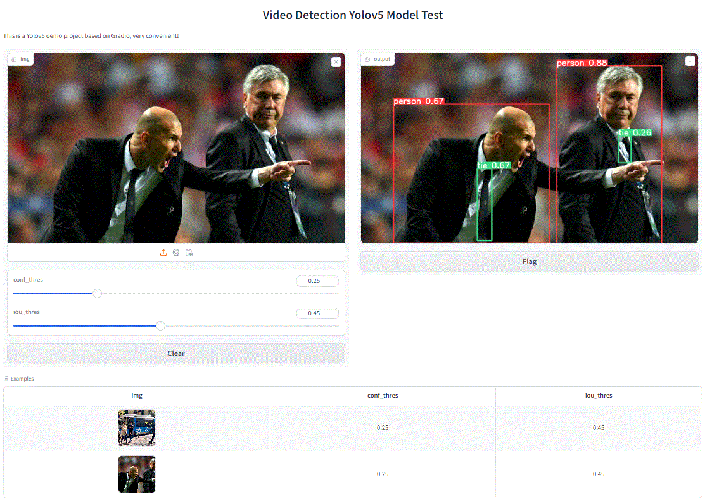

# GUI



## Install

```
pip3 install torch torchvision torchaudio --index-url https://download.pytorch.org/whl/cpu
```

```
pip install -U -r requirements.txt
```

```
pip install gradio
```

## Train

```
python train.py --img 640 --data data/coco128.yaml --cfg models/yolov5x.yaml --weights weights/yolov5s.pt --batch-size 8 --epochs 100
```

## Detect

```
python detect.py --source "../datasets/...*.jpg" --weight="... /best.pt" --view-img
```

## Pages

```
python gradio_demo.py
```

### Demo

```
(yinit) E:\clearproj\guiyolov5>python gradio_demo.py
YOLOv5  2024-6-24 Python-3.11.9 torch-2.3.1+cu121 CUDA:0 (NVIDIA GeForce RTX 4090, 24564MiB)

Fusing layers...
YOLOv5s summary: 213 layers, 7225885 parameters, 0 gradients, 16.4 GFLOPs
Adding AutoShape...
Running on local URL:  http://127.0.0.1:7860
Running on public URL: https://b44336b2f9a2be9035.gradio.live

This share link expires in 72 hours. For free permanent hosting and GPU upgrades, run `gradio deploy` from Terminal to deploy to Spaces (https://huggingface.co/spaces)
```
